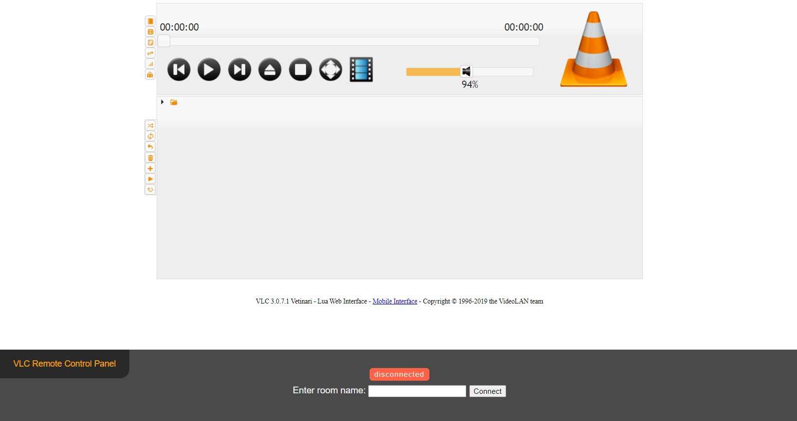

# VLC Sync

This is a very basic implementation of syncing VLC instances over the internet.

This weird setup was created to be able to watch stuff together during the COVID lockdown remotely.

## The basic idea

1) VLC has a web interface for remote control
2) Create a Chrome extension to control the web interface
3) Sync browsers via a WebSocket server
4) Profit

### How to get started

1) Follow this guide to enable the web interface: https://github.com/azrafe7/vlc4youtube/blob/master/instructions/how-to-enable-vlc-web-interface.md
2) Install the Extension from the `chrome-extension` directory
3) If everything went well, you should see a panel inserted to the bottom of the web control interface
4) Type in a room name and "it should work"

Good luck!

### Word of warning

This project is unfinished and as I recall, there are some bugs, but it should give you and idea how a system like this could be achieved.

